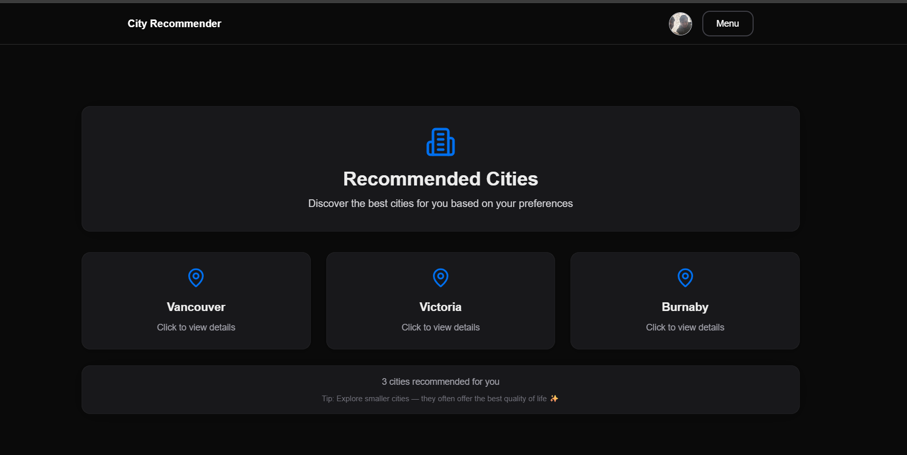

# City Recommender: Your Canadian city Recommender🚀
This application recommends users multiple canadian cities on the basis of specific user preferences.

This application is built with Next.js, integrating a variety of modern technologies to deliver a rich user experience. It leverages AWS for authentication and storage, Prisma for database management, and Tailwind CSS for styling. The application aims to provide a scalable and maintainable architecture, incorporating features like theme switching, UI component libraries, and server-side rendering.

## 🌟 Key Features

- **Authentication**: Secure user authentication using AWS Cognito and `react-oidc-context`.
- **Database Management**: Utilizes Prisma for efficient and type-safe database interactions.
- **UI Components**: Rich UI components from `@heroui/react` and `lucide-react` for a consistent and appealing design.
- **Theming**: Supports light and dark themes with `next-themes`.
- **Mapping**: Implements interactive maps using Leaflet.
- **Background Jobs**: Manages background tasks with Inngest.
- **State Management**: Employs Jotai for simple and scalable state management.
- **Email Sending**: Integrates Resend for reliable email delivery.
- **File Uploads**: Handles file uploads using Formidable and AWS S3.
- **OpenAI Integration**: Leverages the OpenAI API for advanced functionalities.

## 🛠️ Tech Stack

| Category      | Technology                                  | Description                                                                                                |
|---------------|---------------------------------------------|------------------------------------------------------------------------------------------------------------|
| **Frontend**  | Next.js, React, TypeScript                 | Modern framework for building performant and scalable web applications.                                   |
|               | Tailwind CSS, @heroui/react, lucide-react | Utility-first CSS framework and UI component libraries for rapid UI development.                            |
|               | Framer Motion                               | Animation library for creating smooth and engaging user experiences.                                       |
|               | Next Themes                                 | Provides theme support (light/dark mode).                                                                 |
|               | Leaflet, React-Leaflet                      | Library for interactive maps.                                                                              |
| **Backend**   | Node.js, Next.js API Routes                | Server-side logic and API endpoints.                                                                      |
|               | Prisma, @prisma/extension-accelerate        | ORM for type-safe database access and performance enhancements.                                             |
|               | MongoDB, Mongoose                           | NoSQL database and ODM for flexible data storage.                                                          |
|               | Inngest                                     | Platform for managing background jobs and asynchronous tasks.                                               |
| **Database**  | MongoDB                                     | Scalable NoSQL database.                                                                                   |
| **Authentication** | AWS Cognito, react-oidc-context, jwt-decode | Secure user authentication and authorization.                                                               |
| **Cloud**     | AWS (Cognito, S3)                           | Cloud services for authentication and storage.                                                              |
| **AI**        | OpenAI API                                  | Integration with OpenAI for AI-powered features.                                                            |
| **Email**     | Resend                                      | Reliable email delivery service.                                                                           |
| **Utilities** | Cheerio, Dotenv, Formidable, Jotai, UUID, Node-fetch | HTML parsing, environment variable management, form data handling, state management, unique ID generation, HTTP requests. |
| **Linting**   | ESLint, eslint-config-next                  | Code linting for maintaining code quality.                                                               |
| **Typescript**| Typescript                                  | Superset of Javascript which adds static typing.                                                          |
| **Build Tools**| TSX                                       | TSX CLI for running Typescript files.                                                                     |

## 📦 Getting Started

Follow these steps to set up the project locally:

### Prerequisites

- Node.js (version >= 18)
- npm or yarn or pnpm
- MongoDB installed and running
- AWS account configured with Cognito and S3 access
- Resend API Key
- OpenAI API Key

### Installation

1.  Clone the repository:

    ```bash
    git clone https://github.com/sukhad123/City_Recommender.git
    cd prjproject
    ```

2.  Install dependencies:

    ```bash
    npm install # or yarn install or pnpm install
    ```

3.  Set up environment variables:

    Create a `.env` file in the root directory and add the following variables:

    ```
    MONGODB_URI=<your_mongodb_uri>
    AWS_COGNITO_USER_POOL_ID=<your_cognito_user_pool_id>
    AWS_COGNITO_CLIENT_ID=<your_cognito_client_id>
    AWS_REGION=<your_aws_region>
    RESEND_API_KEY=<your_resend_api_key>
    OPENAI_API_KEY=<your_openai_api_key>
    AWS_S3_BUCKET_NAME=<your_s3_bucket_name>
    ```

4.  Prisma Setup:

    ```bash
    npx prisma generate
    ```

5.  Run database migrations:

    ```bash
    npm run migrate
    ```

### Running Locally

1.  Start the development server:

    ```bash
    npm run dev
    ```

    This will start the Next.js development server, and you can access the application at `http://localhost:3000`.

## 💻 Usage

1.  **Access the application**: Open your browser and navigate to `http://localhost:3000`.
2.  **Explore the features**: Use the navigation bar to access different sections of the application.
3.  **Authentication**: Sign in using the provided authentication flow via AWS Cognito.
4.  **Interact with maps**: Explore interactive maps powered by Leaflet.
5.  **Customize the theme**: Switch between light and dark themes using the theme toggle.

## 📂 Project Structure

```
prjproject/
├── .next/                     # Next.js build output
├── node_modules/              # Dependencies
├── public/                    # Static assets
├── src/                       # Source code
│   ├── app/                   # Next.js app directory
│   │   ├── (private)/         # Private routes
│   │   │   ├── dashboard/     # Dashboard page
│   │   │   │   └── page.jsx
│   │   │   └── layout.jsx
│   │   ├── auth/                # Authentication related components
│   │   │   └── utils/
│   │   │       └── signIn.jsx
│   │   ├── components/          # Reusable components
│   │   │   ├── composite/       # Composite components
│   │   │   │   └── Navbar.jsx
│   │   │   └── AboutUs.jsx
│   │   ├── constants/           # Constant values
│   │   │   └── Navbar/
│   │   │       └── constants.js
│   │   ├── page.js              # Home page
│   │   ├── globals.css          # Global styles
│   │   ├── layout.js            # Root layout
│   │   ├── provider.js          # Context providers
│   │   └── hero.js              # HeroUI setup
│   ├── db/                    # Database related files
│   │   └── mongo.js             # Database connection
│   ├── libs/                  # Utility libraries
│   │   └── aws/               # AWS related utilities
│   │       └── cognito/       # Cognito utilities
│   │           └── helper/    # Helper functions
│   │               └── initalizeCognito.js
│   ├── repositories/          # Data repositories
│   │   └── mapPoints.js         # Map point data
│   ├── styles/                # Styles
│   │   └── tailwind.css       # Tailwind CSS file
│   └── utils/                 # Utility functions
├── jsconfig.json              # JavaScript configuration
├── next.config.cjs            # Next.js configuration
├── next.config.mjs            # Next.js configuration
├── package-lock.json          # Dependency lock file
├── package.json               # Project metadata
├── postcss.config.mjs         # PostCSS configuration
├── prisma/                    # Prisma related files
│   └── schema.prisma          # Prisma schema
├── README.md                  # Project documentation
├── tailwind.config.js         # Tailwind CSS configuration
└── tsconfig.json              # TypeScript configuration
```

## 📸 Screenshots
Recommended Cities


## 🤝 Contributing

Contributions are welcome! Please follow these steps:

1.  Fork the repository.
2.  Create a new branch for your feature or bug fix.
3.  Make your changes and commit them with descriptive messages.
4.  Push your changes to your fork.
5.  Submit a pull request to the main repository.

## 📝 License

This project is licensed under the [MIT License](LICENSE).

## 📬 Contact

Sukhad Adhikari
Adnan Mohammed
Yahya
Gordan Tan

## 💖 Thanks Message

Thank you for checking out this project! We hope it provides a solid foundation for building your next-generation application. Your contributions and feedback are highly appreciated.

This is written by [readme.ai](https://readme-generator-phi.vercel.app/).
